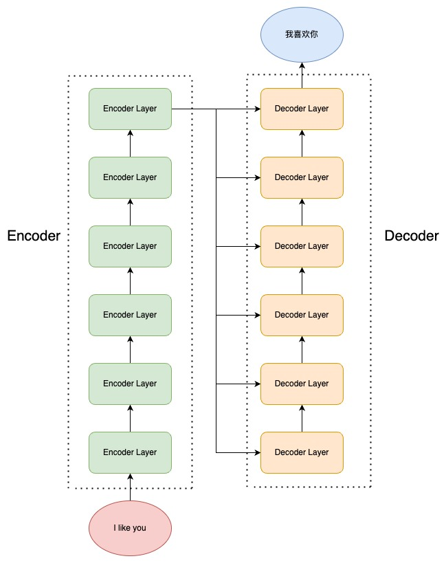
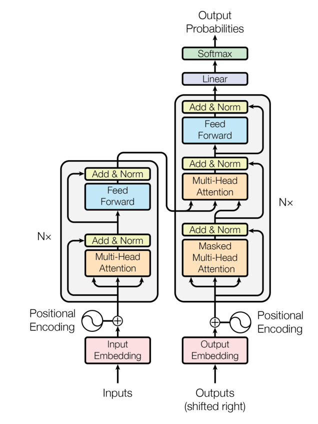
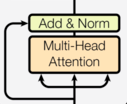

## 1. Transformer概述

### 1.1 模型背景与重要性

Transformer是由Google在2017年发布的革命性神经网络架构，其论文为 [Attention Is All You Need](https://arxiv.org/abs/1706.03762)，重点强调了该架构完全基于注意力机制的核心思想。Transformer的出现彻底改变了序列建模的方式，成为现代大语言模型和各种AI应用的基础架构。

### 1.2 核心创新点

- **完全基于注意力机制**：摒弃了传统的循环神经网络(RNN)和卷积神经网络(CNN)
- **并行计算能力**：能够同时处理序列中的所有位置，大大提高训练效率
- **长距离依赖建模**：通过自注意力机制有效捕捉序列中任意距离的依赖关系
- **可扩展性强**：为大规模模型提供了基础架构

## 2. 注意力机制基础

### 2.1 注意力机制原理

#### 什么是注意力
- 我们观察事物时，之所以能够快速判断一种事物(当然允许判断是错误的), 是因为我们大脑能够很快把注意力放在事物最具有辨识度的部分从而作出判断，而并非是从头到尾的观察一遍事物后，才能有判断结果. 正是基于这样的理论，就产生了注意力机制.

#### 什么是注意力计算规则
- 它需要三个指定的输入Q(query), K(key), V(value), 然后通过公式得到注意力的计算结果, 这个结果代表query在key和value作用下的表示. 而这个具体的计算规则有很多种, 我这里只介绍我们用到的这一种.
$$
Attention(Q,K,V) = softmax(\frac{QK^T}{\sqrt{d_k}})V
$$
- 其中 $d_k$ 是键向量的维度，$\sqrt{d_k}$ 用于缩放以防止梯度消失。

#### 什么是注意力机制原理
- 注意力机制是注意力计算规则能够应用的深度学习网络的载体, 除了注意力计算规则外, 还包括一些必要的全连接层以及相关张量处理, 使其与应用网络融为一体. 使用自注意力计算规则的注意力机制称为自注意力机制.
- 

### 2.2 QKV三要素详解

注意力机制的计算基于三个关键组件：

- **Query (Q)**: 查询向量，代表当前正在处理的token或位置，表示模型需要"查询"的信息
- **Key (K)**: 键向量，代表序列中每个token的唯一标识，用于与Query进行比较计算相似度
- **Value (V)**: 值向量，包含序列中每个token的实际内容或特征，对生成当前token的输出有贡献

Q, K, V的解释
```plaintext
Q, K, V的比喻解释:
假如我们有一个问题: 给出一段文本，使用一些关键词对它进行描述!
为了方便统一正确答案，这道题可能预先已经给大家写出了一些关键词作为提示.其中这些给出的提示就可以看作是key，而整个的文本信息就相当于是query，value的含义则更抽象，可以比作是你看到这段文本信息后，脑子里浮现的答案信息，这里我们又假设大家最开始都不是很聪明，第一次看到这段文本后脑子里基本上浮现的信息就只有提示这些信息，因此key与value基本是相同的，但是随着我们对这个问题的深入理解，通过我们的思考脑子里想起来的东西原来越多，并且能够开始对我们query也就是这段文本，提取关键信息进行表示.这就是注意力作用的过程， 通过这个过程，我们最终脑子里的value发生了变化，根据提示key生成了query的关键词表示方法，也就是另外一种特征表示方法.

刚刚我们说到key和value一般情况下默认是相同，与query是不同的，这种是我们一般的注意力输入形式，
但有一种特殊情况，就是我们query与key和value相同，这种情况我们称为自注意力机制，就如同我们的刚刚的例子， 使用一般注意力机制，是使用不同于给定文本的关键词表示它. 而自注意力机制,
需要用给定文本自身来表达自己，也就是说你需要从给定文本中抽取关键词来表述它, 相当于对文本自身的一次特征提取.
```

### 2.3 注意力机制实现
```Python
def attention(query, key, value, mask=None, dropout=None):
    """注意力机制的实现, 输入分别是query, key, value, mask: 掩码张量, 
       dropout是nn.Dropout层的实例化对象, 默认为None"""
    # 在函数中, 首先取query的最后一维的大小, 一般情况下就等同于我们的词嵌入维度, 命名为d_k
    d_k = query.size(-1)
    # 按照注意力公式, 将query与key的转置相乘, 这里面key是将最后两个维度进行转置, 再除以缩放系数根号下d_k, 这种计算方法也称为缩放点积注意力计算.
    # 得到注意力得分张量scores
    scores = torch.matmul(query, key.transpose(-2, -1)) / math.sqrt(d_k)

    # 接着判断是否使用掩码张量
    if mask is not None:
        # 使用tensor的masked_fill方法, 将掩码张量和scores张量每个位置一一比较, 如果掩码张量处为0
        # 则对应的scores张量用-1e9这个值来替换, 如下演示
        scores = scores.masked_fill(mask == 0, -1e9)

    # 对scores的最后一维进行softmax操作, 使用F.softmax方法, 第一个参数是softmax对象, 第二个是目标维度.
    # 这样获得最终的注意力张量
    p_attn = F.softmax(scores, dim = -1)

    # 之后判断是否使用dropout进行随机置0
    if dropout is not None:
        # 将p_attn传入dropout对象中进行'丢弃'处理
        p_attn = dropout(p_attn)

    # 最后, 根据公式将p_attn与value张量相乘获得最终的query注意力表示, 同时返回注意力张量
    return torch.matmul(p_attn, value), p_attn
```


## 3. 自注意力机制 (Self-Attention)

### 3.1 工作原理

自注意力机制是Transformer的核心创新，其特点是Q、K、V都来自同一个输入序列。这使得序列中的每个token都能感知到序列中所有其他token的信息，从而捕捉内部结构和长距离依赖关系。
在Encoder中Q、K、V分别是输入对参数矩阵 $W_q$、$W_k$、$W_v$ 做乘积得到，从何拟合输入语句中每一个token对其他所有的token的关系

### 3.2 掩码自注意力机制   Mask Self-Attention

掩码自注意力，即 Mask Self-Attention，是指使用注意力掩码的自注意力机制。掩码的作用是遮蔽一些特定位置的 token，模型在学习的过程中，会忽略掉被遮蔽的 token。

使用注意力掩码的核心动机是让模型只能使用历史信息进行预测而不能看到未来信息。使用注意力机制的 Transformer 模型也是通过类似于 n-gram 的语言模型任务来学习的，也就是对一个文本序列，不断根据之前的 token 来预测下一个 token，直到将整个文本序列补全。

例如，如果待学习的文本序列是 【BOS】I like you【EOS】，那么，模型会按如下顺序进行预测和学习：

```plaintext
Step 1：输入 【BOS】，输出 I
Step 2：输入 【BOS】I，输出 like
Step 3：输入 【BOS】I like，输出 you
Step 4：输入 【BOS】I like you，输出 【EOS】
```

理论上来说，只要学习的语料足够多，通过上述的过程，模型可以学会任意一种文本序列的建模方式，也就是可以对任意的文本进行补全。

但是，我们可以发现，上述过程是一个串行的过程，也就是需要先完成 Step 1，才能做 Step 2，接下来逐步完成整个序列的补全。我们在一开始就说过，Transformer 相对于 RNN 的核心优势之一即在于其可以并行计算，具有更高的计算效率。如果对于每一个训练语料，模型都需要串行完成上述过程才能完成学习，那么很明显没有做到并行计算，计算效率很低。

针对这个问题，Transformer 就提出了掩码自注意力的方法。掩码自注意力会生成一串掩码，来遮蔽未来信息。例如，我们待学习的文本序列仍然是 【BOS】I like you【EOS】，我们使用的注意力掩码是【MASK】，那么模型的输入为：

```
<BOS> 【MASK】【MASK】【MASK】【MASK】
<BOS>    I   【MASK】 【MASK】【MASK】
<BOS>    I     like  【MASK】【MASK】
<BOS>    I     like    you  【MASK】
<BOS>    I     like    you   </EOS>
```

在每一行输入中，模型仍然是只看到前面的 token，预测下一个 token。但是注意，上述输入不再是串行的过程，而可以一起并行地输入到模型中，模型只需要每一个样本根据未被遮蔽的 token 来预测下一个 token 即可，从而实现了并行的语言模型。

观察上述的掩码，我们可以发现其实则是一个和文本序列等长的上三角矩阵。我们可以简单地通过创建一个和输入同等长度的上三角矩阵作为注意力掩码，再使用掩码来遮蔽掉输入即可。也就是说，当输入维度为 （batch_size, seq_len, hidden_size）时，我们的 Mask 矩阵维度一般为 (1, seq_len, seq_len)（通过广播实现同一个 batch 中不同样本的计算）。

在具体实现中，我们通过以下代码生成 Mask 矩阵：

```python
# 创建一个上三角矩阵，用于遮蔽未来信息。
# 先通过 full 函数创建一个 1 * seq_len * seq_len 的矩阵
mask = torch.full((1, args.max_seq_len, args.max_seq_len), float("-inf"))
# triu 函数的功能是创建一个上三角矩阵
mask = torch.triu(mask, diagonal=1)
```

生成的 Mask 矩阵会是一个上三角矩阵，上三角位置的元素均为 -inf，其他位置的元素置为0。

在注意力计算时，我们会将计算得到的注意力分数与这个掩码做和，再进行 Softmax 操作：

```python
# 此处的 scores 为计算得到的注意力分数，mask 为上文生成的掩码矩阵
scores = scores + mask[:, :seqlen, :seqlen]
scores = F.softmax(scores.float(), dim=-1).type_as(xq)
```

通过做求和，上三角区域（也就是应该被遮蔽的 token 对应的位置）的注意力分数结果都变成了 `-inf`，而下三角区域的分数不变。再做 Softmax 操作，`-inf` 的值在经过 Softmax 之后会被置为 0，从而忽略了上三角区域计算的注意力分数，从而实现了注意力遮蔽。

#### 2.4 Self-Attention实现   
```python
class SelfAttention(nn.Module):
    """自注意力机制实现"""
    
    def __init__(self, d_model, dropout=0.1):
        super(SelfAttention, self).__init__()
        self.d_model = d_model
        
        # Q, K, V 线性变换层
        self.query = nn.Linear(d_model, d_model)
        self.key = nn.Linear(d_model, d_model)
        self.value = nn.Linear(d_model, d_model)
        
        # 输出线性变换层
        self.out = nn.Linear(d_model, d_model)
        
        # Dropout
        self.dropout = nn.Dropout(dropout)
        
    def forward(self, x, mask=None):
        """
        前向传播
        Args:
            x: 输入张量 (batch_size, seq_len, d_model)
            mask: 注意力掩码 (batch_size, seq_len, seq_len)
        Returns:
            output: 输出张量 (batch_size, seq_len, d_model)
            attention_weights: 注意力权重 (batch_size, seq_len, seq_len)
        """
        batch_size, seq_len, d_model = x.size()
        
        # 计算 Q, K, V
        Q = self.query(x)  # (batch_size, seq_len, d_model)
        K = self.key(x)    # (batch_size, seq_len, d_model)
        V = self.value(x)  # (batch_size, seq_len, d_model)
        
        # 计算注意力分数 Q * K^T / sqrt(d_k)
        scores = torch.matmul(Q, K.transpose(-2, -1)) / math.sqrt(self.d_model)
        
        # 应用掩码（如果提供）
        if mask is not None:
            scores = scores.masked_fill(mask == 0, -1e9)
        
        # 计算注意力权重（softmax）
        attention_weights = F.softmax(scores, dim=-1)
        
        # 应用dropout
        attention_weights = self.dropout(attention_weights)
        
        # 计算注意力输出
        attn_output = torch.matmul(attention_weights, V)
        
        # 输出线性变换
        output = self.out(attn_output)
        
        return output, attention_weights
```

## 4. 多头注意力 (Multi-Head Attention)

### 4.1 多头机制优势

多头注意力机制通过将输入同时进行多个线性变换，每个变换（头）都有自己独立的Q、K、V矩阵，并分别计算自己的注意力得分。这种设计带来以下优势：

- **多样化特征表示**：每个头可以关注不同类型的依赖关系
- **表示子空间**：为模型提供多个表示子空间，增强表达能力
- **并行处理**：多个头可以并行计算，提高效率

### 4.2 计算流程

1. **多头分解**：将输入分成h个头，每个头的维度为d_model/h
2. **独立计算**：每个头独立进行自注意力计算
3. **结果拼接**：将所有头的输出拼接起来
4. **线性变换**：通过最终的线性层得到输出

**数学表示**：
$$
MultiHead(Q,K,V) = Concat(head_1,...,head_h)W_O
$$
其中 $head_i = Attention (QW_i^Q, KW_i^K, VW_i^V)$

**Python代码实现**

```python
import torch.nn as nn
import torch

'''多头自注意力计算模块'''
class MultiHeadAttention(nn.Module):

  def __init__(self, args: ModelArgs, is_causal=False):
	  # 构造函数
	  # args: 配置对象
	  super().__init__()
	  # 隐藏层维度必须是头数的整数倍，因为后面我们会将输入拆成头数个矩阵
	  assert args.dim % args.n_heads == 0
	  # 模型并行处理大小，默认为1。
	  model_parallel_size = 1
	  # 本地计算头数，等于总头数除以模型并行处理大小。
	  self.n_local_heads = args.n_heads // model_parallel_size
	  # 每个头的维度，等于模型维度除以头的总数。
	  self.head_dim = args.dim // args.n_heads

	  # Wq, Wk, Wv 参数矩阵，每个参数矩阵为 n_embd x n_embd
	  # 这里通过三个组合矩阵来代替了n个参数矩阵的组合，其逻辑在于矩阵内积再拼接其实等同于拼接矩阵再内积，
	  # 不理解的读者可以自行模拟一下，每一个线性层其实相当于n个参数矩阵的拼接
	  self.wq = nn.Linear(args.dim, args.n_heads * self.head_dim, bias=False)
	  self.wk = nn.Linear(args.dim, args.n_heads * self.head_dim, bias=False)
	  self.wv = nn.Linear(args.dim, args.n_heads * self.head_dim, bias=False)
	  # 输出权重矩阵，维度为 dim x n_embd（head_dim = n_embeds / n_heads）
	  self.wo = nn.Linear(args.n_heads * self.head_dim, args.dim, bias=False)
	  # 注意力的 dropout
	  self.attn_dropout = nn.Dropout(args.dropout)
	  # 残差连接的 dropout
	  self.resid_dropout = nn.Dropout(args.dropout)

	  # 创建一个上三角矩阵，用于遮蔽未来信息
	  # 注意，因为是多头注意力，Mask 矩阵比之前我们定义的多一个维度
	  if is_causal:
		 mask = torch.full((1, 1, args.max_seq_len, args.max_seq_len), float("-inf"))
		 mask = torch.triu(mask, diagonal=1)
		 # 注册为模型的缓冲区
		 self.register_buffer("mask", mask)

  def forward(self, q: torch.Tensor, k: torch.Tensor, v: torch.Tensor):

	  # 获取批次大小和序列长度，[batch_size, seq_len, dim]
	  batch_size, seqlen, _ = q.shape

	  # 计算查询（Q）、键（K）、值（V）,输入通过参数矩阵层，维度为 (B, T, n_embed) x (n_embed, n_embed) -> 
(B, T, n_embed)
	  xq, xk, xv = self.wq(q), self.wk(k), self.wv(v)

	  # 将 Q、K、V 拆分成多头，维度为 (B, T, n_head, C // n_head)，然后交换维度，变成 (B, n_head, T, C // 
n_head)
	  # 因为在注意力计算中我们是取了后两个维度参与计算
	  # 为什么要先按B*T*n_head*C//n_head展开再互换1、2维度而不是直接按注意力输入展开，是因为view的展开方式是
直接把输入全部排开，
	  # 然后按要求构造，可以发现只有上述操作能够实现我们将每个头对应部分取出来的目标
	  xq = xq.view(batch_size, seqlen, self.n_local_heads, self.head_dim)
	  xk = xk.view(batch_size, seqlen, self.n_local_heads, self.head_dim)
	  xv = xv.view(batch_size, seqlen, self.n_local_heads, self.head_dim)
	  xq = xq.transpose(1, 2)
	  xk = xk.transpose(1, 2)
	  xv = xv.transpose(1, 2)


	  # 注意力计算
	  # 计算 QK^T / sqrt(d_k)，维度为 (B, nh, T, hs) x (B, nh, hs, T) -> (B, nh, T, T)
	  scores = torch.matmul(xq, xk.transpose(2, 3)) / math.sqrt(self.head_dim)
	  # 掩码自注意力必须有注意力掩码
	  if self.is_causal:
		  assert hasattr(self, 'mask')
		  # 这里截取到序列长度，因为有些序列可能比 max_seq_len 短
		  scores = scores + self.mask[:, :, :seqlen, :seqlen]
	  # 计算 softmax，维度为 (B, nh, T, T)
	  scores = F.softmax(scores.float(), dim=-1).type_as(xq)
	  # 做 Dropout
	  scores = self.attn_dropout(scores)
	  # V * Score，维度为(B, nh, T, T) x (B, nh, T, hs) -> (B, nh, T, hs)
	  output = torch.matmul(scores, xv)

	  # 恢复时间维度并合并头。
	  # 将多头的结果拼接起来, 先交换维度为 (B, T, n_head, C // n_head)，再拼接成 (B, T, n_head * C // 
n_head)
	  # contiguous 函数用于重新开辟一块新内存存储，因为Pytorch设置先transpose再view会报错，
	  # 因为view直接基于底层存储得到，然而transpose并不会改变底层存储，因此需要额外存储
	  output = output.transpose(1, 2).contiguous().view(batch_size, seqlen, -1)

	  # 最终投影回残差流。
	  output = self.wo(output)
	  output = self.resid_dropout(output)
	  return output
```

### 4.3 实际效果

- 不同的头可以学习到句法、语义、位置等不同类型的关系
- 增强模型的表示能力和泛化性能
- 提供更丰富的特征组合

## 5. Encoder-Decoder

### 5.1 编码器和解码器结构

Transformer 由 Encoder 和 Decoder 组成，每一个 Encoder（Decoder）又由 6个 Encoder（Decoder）Layer 组成。输入源序列会进入 Encoder 进行编码，到 Encoder Layer 的最顶层再将编码结果输出给 Decoder Layer 的每一层，通过 Decoder 解码后就可以得到输出目标序列了。

Transformer完整结构 

Encoder 层： 
>[!NOTE] 由N个编码器层堆叠而成
>每个编码器层由两个子层连接结构组成
>第一个子层连接结构包括一个**多头自注意力**子层和规范化层以及一个残差连接
>第二个子层连接结构包括一个前馈全连接子层和规范化层以及一个残差连接

Decoder层
>[!NOTE] 由N个解码器层堆叠而成
>每个解码器层由三个子层连接结构组成
>第一个子层连接结构包括一个**多头自注意力**子层和规范化层以及一个残差连接
>第二个子层连接结构包括一个**多头注意力**子层和规范化层以及一个残差连接
>第三个子层连接结构包括一个前馈全连接子层和规范化层以及一个残差连接

### 5.2 前馈神经网络      FFN

#### 5.2.1什么是前馈神经网络
- 在Transformer中前馈全连接层就是具有两层线性层的全连接网络.
#### 5.2.2 前馈全连接层的作用
- 考虑注意力机制可能对复杂过程的拟合程度不够, 通过增加两层网络来增强模型的能力.

#### 5.2.3 Python代码实现  
```Python
class MLP(nn.Module):
    '''前馈神经网络'''
    def __init__(self, dim: int, hidden_dim: int, dropout: float):
        super().__init__()
        # 定义第一层线性变换，从输入维度到隐藏维度
        self.w1 = nn.Linear(dim, hidden_dim, bias=False)
        # 定义第二层线性变换，从隐藏维度到输入维度
        self.w2 = nn.Linear(hidden_dim, dim, bias=False)
        # 定义dropout层，用于防止过拟合
        self.dropout = nn.Dropout(dropout)

    def forward(self, x):
        # 前向传播函数
        # 首先，输入x通过第一层线性变换和RELU激活函数
        # 然后，结果乘以输入x通过第三层线性变换的结果
        # 最后，通过第二层线性变换和dropout层
        return self.dropout(self.w2(F.relu(self.w1(x))))
    
```

### 5.3 规范化层  
层归一化，也就是 Layer Norm，是深度学习中经典的归一化操作。神经网络主流的归一化一般有两种，批归一化（Batch Norm）和层归一化（Layer Norm）。

归一化核心是为了让不同层输入的取值范围或者分布能够比较一致。由于深度神经网络中每一层的输入都是上一层的输出，因此多层传递下，对网络中较高的层，之前的所有神经层的参数变化会导致其输入的分布发生较大的改变。也就是说，随着神经网络参数的更新，各层的输出分布是不相同的，且差异会随着网络深度的增大而增大。但是，需要预测的条件分布始终是相同的，从而也就造成了预测的误差。

因此，在深度神经网络中，往往需要归一化操作，将每一层的输入都归一化成标准正态分布。批归一化是指在一个 mini-batch 上进行归一化，相当于对一个 batch 对样本拆分出来一部分，首先计算样本的均值：
$$
μ_j=\frac{1}{m} \sum_{i=1}^{m} Z_j
$$
其中，$Z_j^{i}$ 是样本 i 在第 j 个维度上的值，m 就是 mini-batch 的大小。

再计算样本的方差：
$$
σ2=\frac{1}{m} \sum_{i=1}^{m} (Z_j^i - \mu_j ) ^2
$$
最后，对每个样本的值减去均值再除以标准差来将这一个 mini-batch 的样本的分布转化为标准正态分布：
$$
\tilde{Z}_j  = \frac{Z_j- \mu_j}{\sqrt{\sigma^2 + \varepsilon}}
$$
此处加上 $\varepsilon$ 这一极小量是为了避免分母为0。

但是，批归一化存在一些缺陷，例如：

- 当显存有限，mini-batch 较小时，Batch Norm 取的样本的均值和方差不能反映全局的统计分布信息，从而导致效果变差；
- 对于在时间维度展开的 RNN，不同句子的同一分布大概率不同，所以 Batch Norm 的归一化会失去意义；
- 在训练时，Batch Norm 需要保存每个 step 的统计信息（均值和方差）。在测试时，由于变长句子的特性，测试集可能出现比训练集更长的句子，所以对于后面位置的 step，是没有训练的统计量使用的；
- 应用 Batch Norm，每个 step 都需要去保存和计算 batch 统计量，耗时又耗力

因此，出现了在深度神经网络中更常用、效果更好的层归一化（Layer Norm）。相较于 Batch Norm 在每一层统计所有样本的均值和方差，Layer Norm 在每个样本上计算其所有层的均值和方差，从而使每个样本的分布达到稳定。Layer Norm 的归一化方式其实和 Batch Norm 是完全一样的，只是统计统计量的维度不同。

#### Layer Norm 数学表达式

对于输入张量 $X \in \mathbb{R}^{B \times T \times d}$（其中 B 是批次大小，T 是序列长度，d 是特征维度），Layer Norm 的计算过程如下：

步骤1：计算每个样本每个位置的均值
$$
\mu = \frac{1}{d} \sum_{i=1}^{d} x_i
$$

步骤2：计算每个样本每个位置的方差
$$
\sigma^2 = \frac{1}{d} \sum_{i=1}^{d} (x_i - \mu)^2
$$

步骤3：Layer Norm 归一化公式
$$
\text{LayerNorm}(x) = \gamma \cdot \frac{x - \mu}{\sqrt{\sigma^2 + \varepsilon}} + \beta
$$

其中：
- $\mu$ 是在特征维度 d 上计算的均值
- $\sigma^2$ 是在特征维度 d 上计算的方差  
- $\gamma$ 是可学习的缩放参数（scale parameter）
- $\beta$ 是可学习的偏移参数（shift parameter）
- $\varepsilon$ 是防止除零的小常数（通常为 1e-6）
 **Batch Norm vs Layer Norm 对比**

| 归一化方法          | 统计维度    | 均值计算                                           | 方差计算                                                            | 适用场景                 |
| -------------- | ------- | ---------------------------------------------- | --------------------------------------------------------------- | -------------------- |
| **Batch Norm** | 在批次维度统计 | $\mu_j = \frac{1}{m} \sum_{i=1}^{m} x_j^{(i)}$ | $\sigma_j^2 = \frac{1}{m} \sum_{i=1}^{m} (x_j^{(i)} - \mu_j)^2$ | CNN、固定输入尺寸           |
| **Layer Norm** | 在特征维度统计 | $\mu = \frac{1}{d} \sum_{i=1}^{d} x_i$         | $\sigma^2 = \frac{1}{d} \sum_{i=1}^{d} (x_i - \mu)^2$           | RNN、Transformer、变长序列 |

#### Layer Norm Python 实现

基于上述数学公式，我们可以实现一个完整的 Layer Norm 层：

```python
import torch
import torch.nn as nn

class LayerNorm(nn.Module):
    """
    Layer Normalization 层实现
    
    对应数学公式：LayerNorm(x) = γ * (x - μ) / √(σ² + ε) + β
    """
    def __init__(self, features, eps=1e-6):
        """
        初始化LayerNorm层
        
        Args:
            features (int): 特征维度大小 d
            eps (float): 防止除零的小常数 ε，默认1e-6
        """
        super(LayerNorm, self).__init__()
        
        # γ (gamma): 可学习的缩放参数，初始化为全1向量
        self.gamma = nn.Parameter(torch.ones(features))
        
        # β (beta): 可学习的偏移参数，初始化为全0向量  
        self.beta = nn.Parameter(torch.zeros(features))
        
        # ε (epsilon): 防止除零的小常数
        self.eps = eps
    
    def forward(self, x):
        """
        前向传播
        
        Args:
            x: 输入张量，形状为 [batch_size, seq_len, features]
            
        Returns:
            normalized: 归一化后的张量，形状与输入相同
        """
        # 步骤1: 计算均值 μ = (1/d) * Σx_i
        # 在最后一个维度（特征维度）上计算均值，keepdim=True保持维度
        mean = x.mean(dim=-1, keepdim=True)  # shape: [batch_size, seq_len, 1]
        
        # 步骤2: 计算方差 σ² = (1/d) * Σ(x_i - μ)²
        # 在最后一个维度上计算方差
        var = x.var(dim=-1, keepdim=True, unbiased=False)  # shape: [batch_size, seq_len, 1]
        
        # 步骤3: 归一化计算 (x - μ) / √(σ² + ε)
        normalized = (x - mean) / torch.sqrt(var + self.eps)  # shape: [batch_size, seq_len, features]
        
        # 步骤4: 应用可学习参数 γ * normalized + β
        # gamma和beta会通过广播应用到所有batch和sequence位置
        output = self.gamma * normalized + self.beta  # shape: [batch_size, seq_len, features]
        
        return output

# 使用示例
if __name__ == "__main__":
    # 创建LayerNorm层，特征维度为512
    layer_norm = LayerNorm(features=512)
    
    # 输入张量：[batch_size=2, seq_len=10, features=512]
    x = torch.randn(2, 10, 512)
    
    # 应用LayerNorm
    output = layer_norm(x)
    
    print(f"输入形状: {x.shape}")
    print(f"输出形状: {output.shape}")
    print(f"输出均值: {output.mean(dim=-1)}")  # 应该接近0
    print(f"输出方差: {output.var(dim=-1)}")   # 应该接近1
```


### 5.4 残差连接   

由于 Transformer 模型结构较复杂、层数较深，​为了避免模型退化，Transformer 采用了残差连接的思想来连接每一个子层。残差连接，即下一层的输入不仅是上一层的输出，还包括上一层的输入。残差连接允许最底层信息直接传到最高层，让高层专注于残差的学习。

​例如，在 Encoder 中，在第一个子层，输入进入多头自注意力层的同时会直接传递到该层的输出，然后该层的输出会与原输入相加，再进行标准化。在第二个子层也是一样。即：
$$
\begin{align}
  x = x + \text{MultiHeadSelfAttention}(\text{Layer
  Norm}(x)) \\
  \text{output} = x +
  \text{FFN}(\text{LayerNorm}(x))
  \end{align}
$$
我们在代码实现中，通过在层的 forward 计算中加上原值来实现残差连接：

```python
# 注意力计算
h = x + self.attention.forward(self.attention_norm(x))
# 经过前馈神经网络
out = h + self.feed_forward.forward(self.fnn_norm(h))
```

在上文代码中，self.attention_norm 和 self.fnn_norm 都是 LayerNorm 层，self.attn 是注意力层，而 self.feed_forward 是前馈神经网络。

### 5.5 Encoder 

#### 5.5.1 Encoder Layer   
```python
class EncoderLayer(nn.Module):
  '''Encoder层'''
    def __init__(self, args):
        super().__init__()
        # 一个 Layer 中有两个 LayerNorm，分别在 Attention 之前和 MLP 之前
        self.attention_norm = LayerNorm(args.n_embd)
        # Encoder 不需要掩码，传入 is_causal=False
        self.attention = MultiHeadAttention(args, is_causal=False)
        self.fnn_norm = LayerNorm(args.n_embd)
        self.feed_forward = MLP(args)

    def forward(self, x):
        # Layer Norm
        norm_x = self.attention_norm(x)
        # 自注意力
        h = x + self.attention.forward(norm_x, norm_x, norm_x)
        # 经过前馈神经网络
        out = h + self.feed_forward.forward(self.fnn_norm(h))
        return out
```

## 6. Transformer架构组件

### 6.1 编码器-解码器结构

Transformer采用经典的编码器-解码器架构：

**编码器**：
- 由N=6个相同的层组成
- 每层包含多头自注意力子层和前馈神经网络子层
- 每个子层都有残差连接和层归一化

**解码器**：
- 同样由N=6个相同的层组成
- 包含三个子层：多头自注意力、编码器-解码器注意力、前馈网络
- 使用掩码防止关注未来位置

### 6.2 残差连接与层归一化

- **残差连接**：缓解深层网络的梯度消失问题
- **层归一化**：加速训练收敛，提高模型稳定性
- 每个子层的输出为：LayerNorm(x + Sublayer(x))

### 6.3 前馈神经网络

每个编码器和解码器层都包含一个全连接前馈网络：
```
FFN(x) = max(0, xW1 + b1)W2 + b2
```

- 包含两个线性变换和一个ReLU激活函数
- 中间层维度通常为模型维度的4倍

## 7. 三种注意力类型对比

### 7.1 Self Attention (自注意力)
- **应用场景**：编码器中的自注意力层
- **特点**：Q、K、V都来自同一序列
- **作用**：捕捉序列内部的依赖关系

### 7.2 Cross Attention (交叉注意力)
- **应用场景**：解码器中的编码器-解码器注意力层
- **特点**：Q来自解码器，K、V来自编码器
- **作用**：让解码器关注编码器的输出信息

### 7.3 Causal Attention (因果注意力)
- **应用场景**：解码器中的自注意力层
- **特点**：使用掩码防止关注未来位置
- **作用**：保证生成过程的自回归特性

## 8. 实际应用与重要性

### 8.1 在大语言模型中的应用

Transformer架构为现代大语言模型奠定了基础：

- **GPT系列**：使用Transformer解码器架构
- **BERT系列**：使用Transformer编码器架构
- **T5、BART**：使用完整的编码器-解码器架构

### 8.2 相比RNN/CNN的优势

**相比RNN**：
- 并行计算能力强，训练效率高
- 更好地处理长距离依赖
- 避免梯度消失/爆炸问题

**相比CNN**：
- 全局感受野，不受卷积核大小限制
- 更灵活的依赖建模能力
- 更适合序列到序列任务

### 8.3 广泛应用领域

- **自然语言处理**：机器翻译、文本生成、问答系统
- **计算机视觉**：Vision Transformer (ViT)
- **语音处理**：语音识别、语音合成
- **多模态学习**：图文理解、视频分析

Transformer架构的成功不仅在于其技术创新，更在于其为人工智能领域带来的范式转变，成为了通向AGI的重要基石。